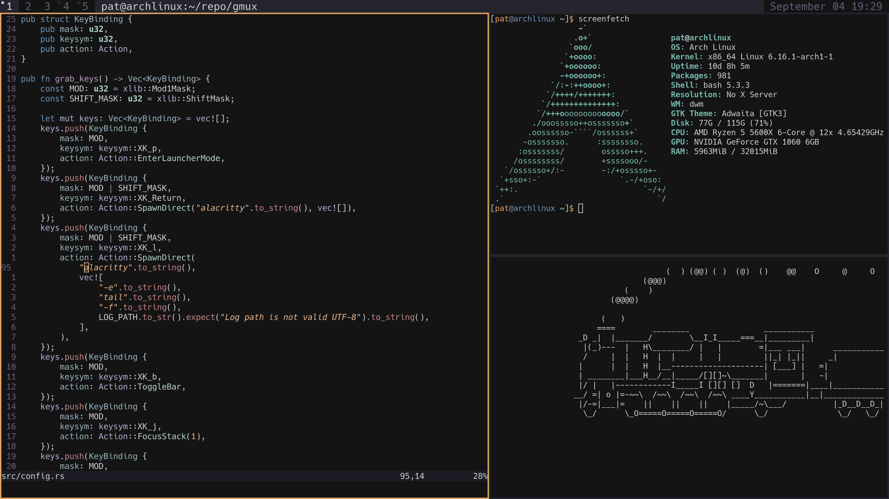

# GMuX
This is a Rust port of dwm. It retains the code-as-config approach while being modularized. Naturally it is still based on X11. MIT Licensed like the original.

Current state is in beta - it is pretty usable, has not been tested with multiple monitors

## Building
* Needs X11 and Xft and other shit
* On arch this is `sudo pacman -S ... blahblahblahblah`

## Installation
* Run ./install.sh which performs a release build and copies it to /usr/local/bin
* Then you would add gmux to .xinitrc or whatever

## New Features
* Integrated log with stderr capture from child processes
* Integrated, .desktop based launcher replacing dmenu
* Integrated screenshotting (requires scrot)
* Integrated status text

## Selected Returning Features
* Rules for applications to launch on a certain tag - good for containing messy apps like steam and discord

## Default Controls
* alt+number to select tag
* shift+alt+number to send to tag
* alt+enter to bring window to top
* shift+alt+enter to open terminal (assumes you have "alacritty")
* alt+i to increase number of primary windows
* alt+d to decrease number of primary windows
* alt+j and alt+k to focus next/prev
* alt+p opens launcher
* printscreen takes screenshot
* alt+printscreen takes screenshot of focused window
* alt+s to snipping tool
* Scroll on the bar or alt+[shift]+tab to change tags
* shift+alt+l to open log
* alt+h to decrease primary area
* alt+l to increase primary area

## Colour Scheme
* Based on [vague vim theme](https://github.com/vague2k/vague.nvim), see colour codes [here](https://xpjb.github.io/tools/palette.html)

## Removed Features
* Monocle/fullscreen/floating/drag resize - semi removed, i dont use it. ??
* Tags 6-9 - less is more?? 
* Idk just add these back in with CC if you miss them lol

## Things it would be nice to have
* No X server thing might be a bug lol
* Focus on mouse movement - i3 and dwm dont have this either (mouse change is fine)
* Sometimes the redrawing with notifications etc is a bit jank. it doesnt redraw when it gets one and it doesnt redraw when it expires either
* Maybe a notification for successful screenshot too
* Run spin loop.. needs fps limit. powr usage etc
* Test performance of launcher caching too
* Getting an error in launcher state would probably cook you
* test kills the x session and orphans all the windows and theyre in some other session, cooked

# Some ideas
* Keybindings for volume up/down
* Keybindings for brightness up/down
